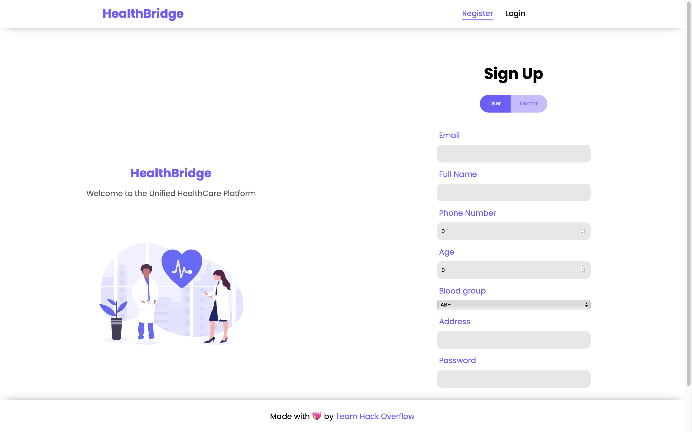
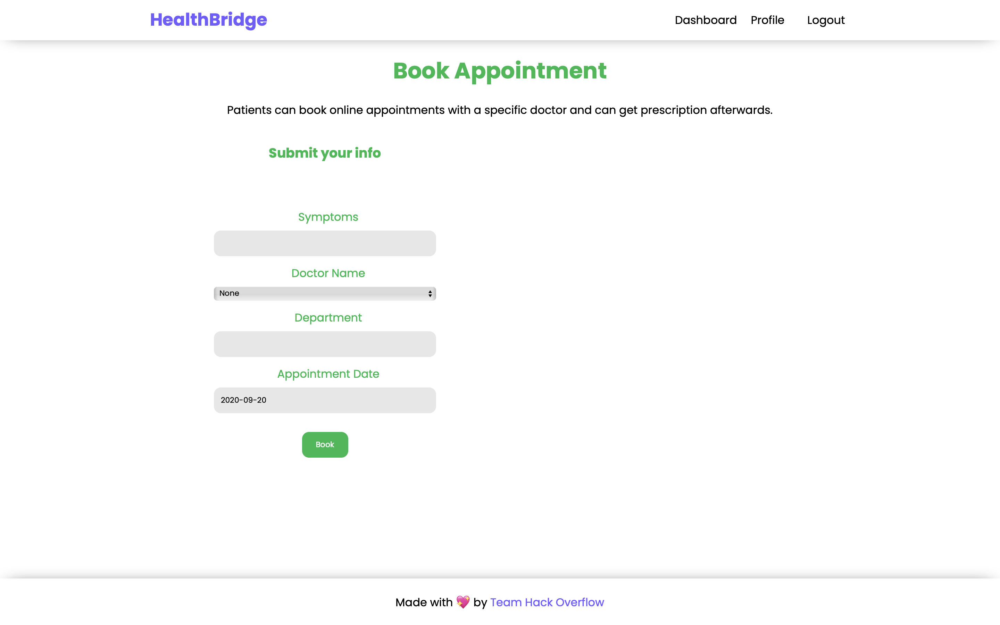
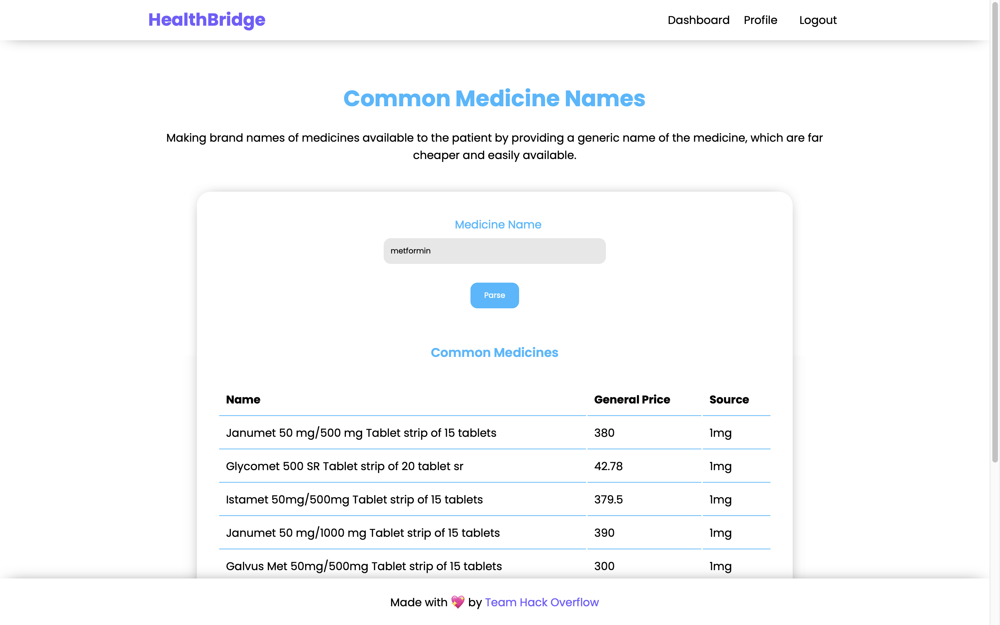

<!-- PROJECT LOGO -->
<br />
<p align="center">
  <a href="https://github.com/radiaoctive11/HealthBridge">
    

    
  </a>

  <h1 align="center">Project HealthBridge</h1>

  <p align="center">
    Bridging the gap between Patients and Doctors 
    <br />
    <a href="https://eureka-web.vercel.app"><strong>Visit the website »</strong></a>
    <br />
    <br />
    <a href="https://eureka-web.vercel.app">View Demo</a>
    ·
    <a href="https://github.com/radiaoctive11/HealthBridge/issues">Report Bug</a>
    ·
    <a href="https://github.com/radiaoctive11/HealthBridge/issues">Request Feature</a>
  </p>
</p>


<!-- TABLE OF CONTENTS -->
## Table of Contents

* [About the Project](#about-the-project)
  * [Predictions](#predictions)
  * [Ambulance on Demand](#ambulance-on-demand)
  * [Built With](#built-with)
* [Getting Started](#getting-started)
  * [Prerequisites](#prerequisites)
  * [Installation](#installation)
* [Usage](#usage)
* [Roadmap](#roadmap)
* [Contributing](#contributing)
* [Contact](#contact)


<!-- ABOUT THE PROJECT -->
## About The Project

[![Product Name Screen Shot][product-screenshot]](https://eureka-web.vercel.app)

The aim of **Project HealthBridge** is to make the interaction of patients and doctors **seamless**, **convenient** and **more organized**. This platform is built keeping in mind the problems and hassles one has to face while using any medical facility via hospitals.

:face_with_thermometer: **Here's what we provide for patients**: 

:page_facing_up: Doctor appointment booking

:microscope: Lab test booking   

:receipt: Online prescription & medical history database

:pill: Generic drugs to brand name converter & recommendation system

:ambulance: Ambulance on demand service

:dna: Disease prediction services

<br/>

:health_worker: **For doctors, we provide the following services**: 


:computer: Appointment management system

:black_nib: Online prescriptiion creation system

:medical_symbol: View medical history and previous appointments of patient

:exclamation: Prioritized lab results for disease infected patients 

For detailed descriiption of the services, plese visit the [usage](#usage) section

<br />


## Predictions

We used Tensorflow to train a CNN which predicts Pneumonnia (from chest-xrays) and Breast Cancer (from cell images) with accuracy of 97% and 92% respectively.


<br />

## Ambulance on Demand

A MERN Web App in which patients can make requests to the ambulance person in real time and depending upon the patient's location, the nearby ambulance will respond to the patients' request.

<br />

## Built With

</br>
<p float = "left">


</p>


<!-- GETTING STARTED -->
## Getting Started

To get a local copy up and running follow these simple example steps.

### Prerequisites

* Node.js
* Python 3.6+


### Installation 

<br />

#### Flask API
<br />

1. Clone the repo 
```sh
git clone https://github.com/radioactive11/HealthBridge
```

2. Install requirements
```sh
pip3 install -r requirements.txt
```

3. Start Flask server (by default at `localhost:5555`)
```sh
cd ML
python3 app.py
```

<br />

#### Node & React 

<br />

1. Clone the repo 
```sh
git clone https://github.com/radioactive11/HealthBridge
```

2. Install requirements (server)
```sh
cd server
npm install
```

3. Start Node server (by default at `localhost:5000`)
```sh
npm run dev
```

4. Install requirements (client)
```sh
cd ../client
npm install
```

5. Start React server (by default at `localhost:3000`)
```sh
npm start
```

<br />


#### Ambulance on Demand


<br />

1. Clone the repo 
```sh
git clone https://github.com/radioactive11/HealthBridge
```
2. Do ```npm run dev ```to run the development server.

3. Now go to http://localhost:3000 and set your own location as patient and make request to the ambulance.

4. Open http://localhost:3000/01 , http://localhost:3000/02 till 04 in other tabs .

5. The nearby ambulance will receive the requests and thus requests can be accepted from there.

<!-- USAGE EXAMPLES -->
## Usage

* Firstly, you need to create an account in the SignUp page





* After that, you need to login with the credentials you used to register

* Upon successful login, you will be greeted with a dashboard which will list the available services


* If you want to book an appointment, click on *Book Appointment* and then fill up the appointment form. You can also view your previous appointments here





* For getting branded names of generic medicines, just enter the name of the generic drug and click submit





<!-- ROADMAP -->
## Roadmap

See the [open issues](https://github.com/radiaoctive11/HealthBridge/issues) for a list of proposed features (and known issues).


<!-- CONTRIBUTING -->
## Contributing

Contributions are what make the open source community such an amazing place to be learn, inspire, and create. Any contributions you make are **greatly appreciated**.

1. Fork the Project
2. Create your Feature Branch (`git checkout -b feature/AmazingFeature`)
3. Commit your Changes (`git commit -m 'Add some AmazingFeature'`)
4. Push to the Branch (`git push origin feature/AmazingFeature`)
5. Open a Pull Request


<!-- CONTACT -->
## Contact

Arijit Roy - [GitHub](https://github.com/radioactive11) - roy.arijit2001@gmail.com

Kartik Goel - [GitHub](https://github.com/kg-kartik) - goel.kartik39@gmail.com

Aman Jagdev - [GitHub](https://github.com/amanjagdev) - amankumarjagdev@gmail.com

Website: [https://eureka-web.vercel.app/](https://eureka-web.vercel.app/)


<p align = "center" >Made with :purple_heart: for :india: </p>


<!-- MARKDOWN LINKS & IMAGES -->
<!-- https://www.markdownguide.org/basic-syntax/#reference-style-links -->
[contributors-shield]: https://img.shields.io/github/contributors/radiaoctive11/HealthBridge.svg?style=flat-square
[contributors-url]: https://github.com/radiaoctive11/HealthBridge/graphs/contributors
[forks-shield]: https://img.shields.io/github/forks/radiaoctive11/HealthBridge.svg?style=flat-square
[forks-url]: https://github.com/radiaoctive11/HealthBridge/network/members
[stars-shield]: https://img.shields.io/github/stars/radiaoctive11/HealthBridge.svg?style=flat-square
[stars-url]: https://github.com/radiaoctive11/HealthBridge/stargazers
[issues-shield]: https://img.shields.io/github/issues/radiaoctive11/HealthBridge.svg?style=flat-square
[issues-url]: https://github.com/radiaoctive11/HealthBridge/issues
[license-shield]: https://img.shields.io/github/license/radiaoctive11/HealthBridge.svg?style=flat-square
[license-url]: https://github.com/radiaoctive11/HealthBridge/blob/master/LICENSE.txt
[linkedin-shield]: https://img.shields.io/badge/-LinkedIn-black.svg?style=flat-square&logo=linkedin&colorB=555
[linkedin-url]: https://linkedin.com/in/othneildrew
[product-screenshot]: images/ss1.png

[node-js]: "https://img.shields.io/badge/-JavaScript-F7DF1E?style=flat-square&logo=javascript&logoColor=black"


